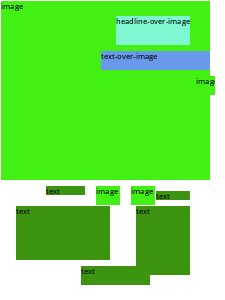
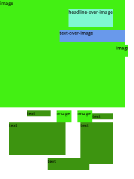
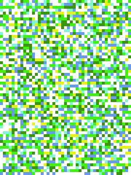

# content-aware-model

## 使用方法 Quick Start

创建 `dataset` 文件夹，将数据集放入这个文件夹。数据集下载：[百度网盘](https://pan.baidu.com/s/1OFNEfQvoEdwhdIgk8Ct0rQ?pwd=o500) | [源地址](https://portland-my.sharepoint.com/:f:/g/personal/xqiao6-c_my_cityu_edu_hk/EhmRh5SFoQ9Hjl_aRjCOltkBKFYefiSagR6QLJ7pWvs3Ww?e=y8HO5Q)

接着在 `dataset` 中创建一个 `layout` 文件夹


然后在 `models` 文件夹中放入 `GoogleNews-vectors-negative300.bin`，下载链接：[GoogleNews-vectors](https://drive.google.com/file/d/0B7XkCwpI5KDYNlNUTTlSS21pQmM/edit?usp=sharing)

最终项目结构如下：

```shell
.
├── README.md
├── assets
├── dataset
│   ├── annotations
│   ├── images
│   └── layout
├── fonts
├── models
│   ├── GoogleNews-vectors-negative300.bin
│   └── Instr.md
├── utils
├── layout_gn.py
├── multi_en.py
├── playgound.py
├── recover.py
└── train.py
```

首先运行 `multi_en.py` 生成多模态融合向量，结果将生成至 `./models/multimodal.pt` 中。

然后运行 `train.py` 即可在 `./dataset/layout` 文件夹中看到生成结果

## 各模块介绍

`./utils/read_data.py` 基础的读取各个数据的模块

`./utils/settings.py` 全局的一些配置，包括颜色，布局尺寸

`multi_en.py` 多模态融合网络

`layout_en.py` 布局生成网络

`recover.py` 从布局信息生成布局图片，比如从数据集的layout标注中生成布局图片，也可以从3\*60\*45的Tensor生成布局图片

`train.py` 网络训练（未完成）

`playground.py` 测试用的模块


## 目前的示例

原始数据集中的布局(fashion_0030)：



网格化后(60*45)的布局:



从初始网络中生成的 Tensor 转换后的布局：

